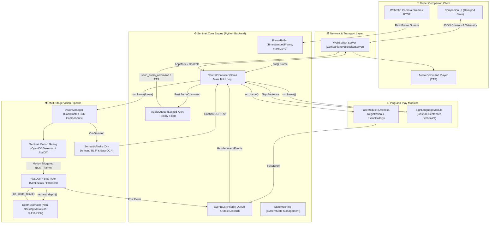

# 🛡️ Sentinel: Multimodal User Accessibility & Hazard Avoidance System

> A state-of-the-art, low-latency assistive technology framework designed for the visually and aurally impaired. Sentinel integrates real-time object detection, deep-learning-based depth estimation, facial recognition, sign language translation, and semantic scene understanding into a unified, high-concurrency architecture.

---

### 🎥 System Demonstration Video
<!-- In technical interviews, a visual demo is worth a thousand words. Embed your YouTube demo link below: -->
[](https://www.youtube.com/watch?v=YOUR_VIDEO_ID)
*Click the banner above to watch the Sentinel system architecture, real-time hazard avoidance, and Flutter companion app in action.*

---

## 🛠️ Technical Stack & Frameworks

<div align="center">
  
  **Core Engine & AI Backend**
  
  
  
  
  
  
  
  **Cross-Platform Client**
  
  
  
  
  

</div>

---

## 📌 Table of Contents

- [🔄 System Architecture](#-system-architecture)
- [⏱️ Central Controller (`CentralController`) & Concurrency Design](#️-central-controller-centralcontroller--concurrency-design)
  - [The 33ms (30 FPS) Real-Time Tick](#the-33ms-30-fps-real-time-tick)
  - [Event Bus & Non-Blocking Priority Queue](#event-bus--non-blocking-priority-queue)
- [🤖 State Machine & Dynamic Resource Allocation](#-state-machine--dynamic-resource-allocation)
  - [System States \& Transitions](#system-states--transitions)
  - [Dynamic Vision Levels](#dynamic-vision-levels)
- [📦 High-Performance Frame Buffer](#-high-performance-frame-buffer)
- [👁️ Vision & Depth Pipeline](#️-vision--depth-pipeline)
  - [Sentinel (Motion Gating)](#sentinel-motion-gating)
  - [Safety Pipeline (YOLOv8 & ByteTrack)](#safety-pipeline-yolov8--bytetrack)
  - [Depth Estimator (Non-Blocking MiDaS with Adaptive Cache)](#depth-estimator-non-blocking-midas-with-adaptive-cache)
  - [Depth-Based Scoring & Hazard Categorization](#depth-based-scoring--hazard-categorization)
- [🧠 Semantic Models (On-Demand)](#-semantic-models-on-demand)
- [👤 Face & Sign Language Modules](#-face--sign-language-modules)
- [📱 Flutter Companion Application](#-flutter-companion-application)
- [🚀 Local Setup & Installation](#-local-setup--installation)

---

## 🔄 System Architecture



---

## ⏱️ Central Controller (`CentralController`) & Concurrency Design

The `CentralController` represents the orchestrator of the entire ecosystem. It uses a **loosely-coupled modular architecture** that guarantees that frame ingestion, heavy deep-learning model inference, state transitions, audio feedback, and WebSocket telemetry communication happen concurrently without blocking the main event-driven thread.

### The 33ms (30 FPS) Real-Time Tick
The system executes a strictly regulated main-thread loop targeting a **33ms tick rate** (`SystemConfig.CONTROLLER_TICK_SEC = 0.033`).

During each tick:
1. **Frame Pull**: The controller pulls the latest frame from the `FrameBuffer`.
2. **Distribution**: If a frame is available, it is distributed asynchronously to the registered modules (`VisionManager`, `FaceModule`, `SignModule`) via thread-safe callbacks.
3. **Event Processing**: The controller processes up to 10 queued events from the `EventBus` (e.g. key triggers, camera state updates, user voice intent requests).
4. **Health Check**: Every 100 ticks (~3 seconds), a system-wide diagnostic check verifies module health, frame latency, and audio queue backlogs.
5. **Tick Overrun Compensation**: The controller measures the elapsed loop time. If it runs within 33ms, it sleeps for the remaining time. If a tick overrun is detected, it logs it to avoid system stutter.

```python
# Core implementation of the 33ms Tick Loop in CentralController
def _main_loop(self):
    tick_count = 0
    while self._running:
        tick_start = time.time()
        tick_count += 1
        try:
            frame = self._frame_buffer.pull()
            if frame is not None:
                self._distribute_frame(frame)
            self._event_bus.process_events(max_events=10)
            if tick_count % 100 == 0:
                self._health_check()
        except Exception as e:
            logger.error(f'Main loop error: {e}', exc_info=True)
            
        elapsed = time.time() - tick_start
        sleep_time = SystemConfig.CONTROLLER_TICK_SEC - elapsed
        if sleep_time > 0:
            time.sleep(sleep_time)
```

### Event Bus & Non-Blocking Priority Queue
All communication between subsystems is mediated via a thread-safe `EventBus`.
- **Priority Enqueueing**: Events are classified based on urgency (e.g. `VisionEventType.RISK` has the highest priority `0`, whereas `VisionEventType.NONE` is a `8`).
- **Stale Discard**: To prevent lag spikes, any event older than `SystemConfig.MAX_FRAME_AGE_MS` (300ms) is automatically discarded when popped from the queue.

---

## 🤖 State Machine & Dynamic Resource Allocation

The controller implements a deterministic State Machine (`StateMachine`) representing the current operational environment. 

### System States & Transitions

| System State | Vision Level | Target FPS | Sentinel Gating | Description |
| :--- | :--- | :--- | :--- | :--- |
| `IDLE` | `sentinel_only` | 0 (YOLO asleep) | Active | System ready. YOLO runs only on pixel motion. |
| `NAVIGATION` | `sentinel_and_safety` | 5 FPS | Deactivated | User walking. YOLO + ByteTrack active. |
| `ALERT` | `sentinel_and_safety` | 5 FPS | Deactivated | Hazard detected. User warned, semantic models paused. |
| `ACTIVE_WALK_OVERRIDE` | `sentinel_and_safety_max` | 10 FPS | Deactivated | User forces max safety. YOLO runs at maximum speed. |
| `SEMANTIC` | `sentinel_and_semantic` | 0 (YOLO paused) | Active | User requested caption or OCR. YOLO paused. |

### Dynamic Vision Levels
To conserve battery life and CPU usage on embedded systems (e.g. Raspberry Pi/NVIDIA Jetson), the controller dynamically adjusts the vision pipeline:
- **`LEVEL_SENTINEL_ONLY`**: YOLO and MiDaS are idle. The `Sentinel` OpenCV motion sensor monitors the frame. If motion is detected, it wakes up the safety pipeline reactively for a single evaluation.
- **`LEVEL_SENTINEL_SAFETY`**: Continuous frame monitoring at `5 FPS`. Sentinel motion gating is bypassed.
- **`LEVEL_SENTINEL_MAX`**: Continuous frame monitoring at `10 FPS` for maximum safety.
- **`LEVEL_SENTINEL_SEMANTIC`**: YOLO is suspended to free GPU/CPU memory for resource-heavy models (BLIP, EasyOCR).

---

## 📦 High-Performance Frame Buffer

To decouple the video stream ingestion (from camera or WebRTC socket) and the processing tick rate, the system implements a custom, thread-locked `FrameBuffer`:
- **Thread-safe Deque**: Uses a Python `collections.deque` with `maxlen=2`. If a new frame arrives before the previous one is processed, the older frame is instantly dropped, ensuring zero accumulative lag.
- **Stale Detection**: Each frame is wrapped in a `TimestampedFrame` class. When pulled, the age is evaluated against `SystemConfig.MAX_FRAME_AGE_MS` (300ms) to ensure only fresh data is analyzed.

---

## 👁️ Vision & Depth Pipeline

The vision pipeline is managed by `VisionManager` and coordinated as follows:

```
[Raw Frame Input]
       │
       ▼
┌──────────────┐      Stable (No Motion)
│  Sentinel   ├──────────────────────────────► [Rate-limited NONE Event]
└──────┬───────┘
       │ Area Ratio >= 0.005 (Motion detected)
       ▼
┌──────────────┐
│   YOLOv8     │ ◄─── Object Detection (Hazard Class Filter)
└──────┬───────┘
       │
       ▼
┌──────────────┐
│  ByteTrack   │ ◄─── Temporal Object Tracking Across Frames
└──────┬───────┘
       │
       ▼
┌──────────────┐      Needs Update? (Growing area / Cache Timeout)
│MiDaS Depth   ├──────────────────────────────► [Run Non-Blocking MiDaS Inference]
└──────┬───────┘
       │ (NEAR, MID, FAR Zones)
       ▼
┌──────────────┐
│ Hazard Score ├──────────────► [Emit RISK or NONE Event to EventBus]
└──────────────┘
```

### Sentinel (Motion Gating)
A low-overhead OpenCV preprocessing stage. It converts frames to grayscale, applies a Gaussian Blur, and computes an absolute difference against the previous frame. If the changed pixels ratio exceeds `0.005`, a `MOTION` event is triggered. This gating prevents running heavy YOLOv8 inferences on static scenes.

### Safety Pipeline (YOLOv8 & ByteTrack)
Runs YOLOv8 model inference to identify potential hazards (`person`, `vehicle`, `dog`, `car`, `truck`, `bus`, `motorcycle`). Detections are fed into **ByteTrack** to maintain identities across frame boundaries.

### Depth Estimator (Non-Blocking MiDaS with Adaptive Cache)
Because running standard MiDaS models is computationally intensive and takes longer than 33ms, depth estimation is decoupled:
1. **Background Thread Pool**: Depth requests are submitted asynchronously to a background thread containing the **MiDaS** model (`DPT_Hybrid`).
2. **Non-Blocking Lock**: If the estimator is busy, requests are dropped immediately to avoid clogging.
3. **Adaptive Cache**: Depth is cached and reused unless:
   - The tracked bounding box grows by $>10\%$ (indicating the object is rapidly approaching).
   - The cached depth has timed out (e.g. 500ms for close hazards, 1500ms for distant hazards).
   - An object's area exceeds `35%` of the frame, triggering an **Imminent Collision Override** (immediately maps to `NEAR` depth without waiting for MiDaS).

### Depth-Based Scoring & Hazard Categorization
Sentinel employs a sophisticated hazard heuristic based on object type and its distance zone:

$$\text{Hazard Score} = (\text{Area Ratio} \times 1.2) + (\text{Frame Bounding Box Bottom Pos} \times 0.8)$$

The final score is evaluated according to specific class-based guidelines:
* **Person**: Alerts only if they enter the `NEAR` depth zone. Suppresses duplicate alerts for the same track.
* **Moving Vehicles (Car, Motorcycle, Truck, Bus)**: Dangerous at both `NEAR` (always alerts) and `MID` (alerts once and suppresses unless approaching).
* **Moving Animals (Dog)**: Evaluated with custom multipliers to alert at `NEAR` and warning alerts at `MID` and `FAR` to prevent startled responses.

---

## 🧠 Semantic Models (On-Demand)

When the user requests a description of their environment or wants to read text in front of them:
1. The system transitions to the `SEMANTIC` state, suspending YOLOv8.
2. **Image Captioning**: Powered by Salesforce `Salesforce/blip-image-captioning-base` to produce descriptive representations of the scene (e.g., *"I see: a wooden table with a white cup"*).
3. **OCR (Optical Character Recognition)**: Powered by `EasyOCR`. Extracted text is checked for language correctness using `langdetect` to ensure only legible English text is read back to the user.
4. If the system enters an `ALERT` state during semantic inference, the task is immediately canceled, the worker thread finishes silently, and its results are discarded to prioritize user safety.

---

## 👤 Face & Sign Language Modules

- **Face Registration & Gallery**: Captures dynamic pose requirements (`front`, `left`, `right`) of a user to register their identity. Verified embeddings are stored in a serialized pickle database (`PickleFaceGallery`).
- **Face Identification**: Matches face embeddings in the frame against the gallery using cosine similarity. If confirmed, the Central Controller triggers a high-priority speech command announcing their name.
- **Sign Language Module**: Analyzes gesture streams to compile full sign language sentences. Recognised sentences are instantly pushed to the WebSocket channel to be displayed on the companion app.

---

## 📱 Flutter Companion Application

The **Sentinel Companion App** acts as the frontend client. It connects to the Python Central Controller over a local WebSocket, enabling:
* **Real-time Camera Streaming**: Feeds WebRTC streams from the mobile camera directly to the controller's `FrameBuffer`.
* **State Visualization**: Displays the current active system state (`Idle`, `Navigation`, `ALERT`, etc.) in real time.
* **Actionable Audio Feedback**: Receives speech commands directly from the backend queue and reads them aloud using Native Text-To-Speech (TTS).

---

## 🚀 Local Setup & Installation

### 1. Prerequisites
- Python 3.10+
- CUDA Toolkit (recommended for GPU-accelerated YOLO & MiDaS)
- Flutter SDK (for companion app)

### 2. Backend Setup
1. Navigate to the central controller directory:
   ```bash
   cd C_CONTROLLER
   ```
2. Create and activate a virtual environment:
   ```bash
   python -m venv venv
   vscripts/activate  # On Windows: .\venv\Scripts\activate
   ```
3. Install the dependencies:
   ```bash
   pip install -r requirements.txt
   ```
4. Download the YOLOv8 model weights (`yolov8m.pt`) and place them in the root of the `C_CONTROLLER/` directory.
5. Create a `.env` file containing local configurations:
   ```env
   LOG_LEVEL=INFO
   DEBUG_DISPLAY=True
   FACE_BACKEND_DEVICE=cuda
   ```
6. Run the controller:
   ```bash
   python main.py
   ```

### 3. Flutter Client Setup
1. Navigate to the companion app directory:
   ```bash
   cd MULTI_MODAL_FLUTTER
   ```
2. Get Flutter packages:
   ```bash
   flutter pub get
   ```
3. Configure the backend socket URL inside the app preferences panel (e.g. `ws://192.168.1.100:8080`).
4. Run the application:
   ```bash
   flutter run -d chrome  # or select your connected Android/iOS device
   ```

---

*Sentinel: Bridging modern computer vision and accessibility through high-performance concurrency.*
